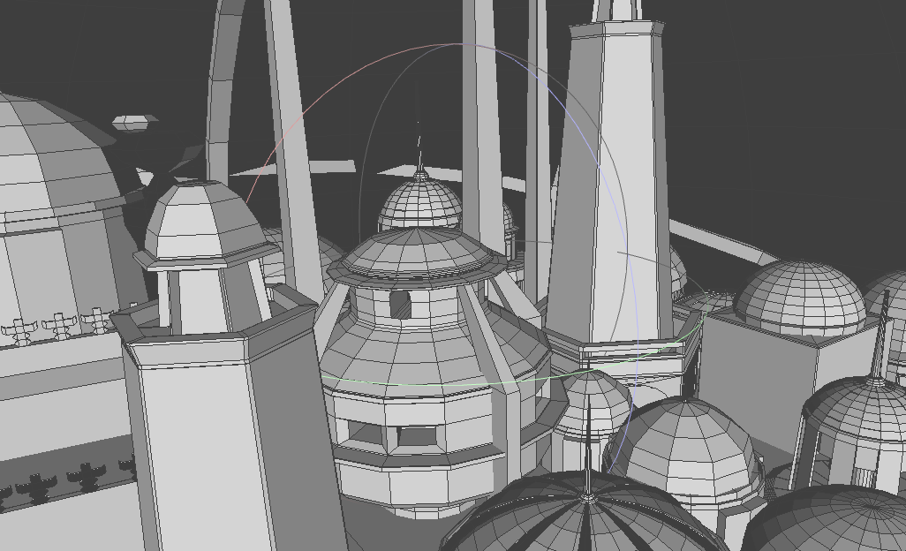

# Hierarchical Z-Buffer 

本程序实现了层次 z-buffer 算法（简单模式和八叉树完整模式）。

## 文件结构

```
src/
├── bbox.cpp
├── bbox.h              Bounding Box 定义
├── CMakeLists.txt
├── global.h            全局变量、杂项函数等
├── main.cpp            主函数，调用三种算法
├── misc.cpp
├── misc.h              计时器、颜色定义
├── scene.cpp
├── scene.h
├── triangle.cpp
├── triangle.h          三角形定义
├── zbuf.cpp
└── zbuf.h              z-buffer 数据结构与算法
include
└── tiny_obj_loader.h   
img                       
└── ...
CMakeLists.txt 
README.md
```

## 编程环境、构建与运行

- 硬件：AMD Ryzen 7 5800H 
- 编程环境：
  - Arch Linux 5.15.12-arch1-1
  - g++ (GCC) 11.1.0
  - cmake version 3.22.1
- 依赖外部库：glm

构建方式
```
$ mkdir build && cd build
$ cmake ..
$ make
```

运行 `build/hiz`
```
# ./hiz {obj-file-name} {camera-distance-to-origin-point}

$ ./hiz input.obj 10
```

程序会在运行目录下生成三张 `ppm` 格式的图片，代表 z-buffer 算法、层次 z-buffer 算法（简单模式）、层次 z-buffer 算法（八叉树完整模式）所得到的图片结果。面片的颜色通过三角片坐标计算得到。

可以在 `global.h` 中调整输出图片大小，默认为 1000x1000

## 数据结构与程序流程

程序读取 obj 文件后，将所有面片投影到屏幕坐标，并依次调用以下三种算法。

首先调用最简单的深度 z-buffer 算法。该算法直接将三角形光栅化并通过深度检测画出。

然后调用 层次 z-buffer 算法（简单模式）。该算法首先建立 层次 z-buffer，然后将三角形依次放入 层次 z-buffer 中判断是否被消隐。若没有，则使用深度 z-buffer 算法 画出该三角形。

最后调用 层次 z-buffer 算法（八叉树完整模式）。该算法首先建立 层次 z-buffer。然后根据所有三角形构造八叉树，根据八叉树的空间前后关系，先画靠前的三角形，后画靠后的三角形。注意八叉树的构造不是显式的，而是通过递归完成空间的分割的。

## 实验结果

条件：使用 release 版本测试程序。所有生成图片的视角均为从顶部往下看向原点。所有算法均不包括读入文件、转换到屏幕坐标与输出图片的时间。简单模式和完整模式的层次 zbuffer算法均包含建树的时间。

### 场景1

半球包围的小城市。该场景外表为半球，半球覆盖了内部的城市细节。面片数为 75901





若距离较远，结果如下


若距离较近，结果如下


|            | zbuffer   | 层次 zbuffer  | 层次zbuffer+八叉树 |
| ---------- | --------- | ------------- | ------------------ |
| 远距离时间 | **74** ms | 123 ms (+66%) | 99 ms (+33%)       |
| 近距离时间 | 233 ms    | 92 ms (-60%)  | **65** ms (-72%)   |

### 场景2

宇宙飞船，包含 775186 面片


距离较远，结果如下


距离较近，结果如下


|            | zbuffer    | 层次 zbuffer  | 层次zbuffer+八叉树 |
| ---------- | ---------- | ------------- | ------------------ |
| 远距离时间 | **120** ms | 170 ms (+41%) | 168 ms (+40%)      |
| 近距离时间 | **260** ms | 316 ms (+21%) | 308 ms (+18%)      |

## 总结

1. 层次 z-buffer 的消隐效率难以估计，在大多数一般场景下可能没有一般的深度 z-buffer 效果好
   - 在大多数情况下，绝大多数三角面片在屏幕空间很小，直接光栅化代价甚至小于消隐代价
   - 不少事实上被遮挡的面片仍然不能在 层次 z-buffer 中被消隐
2. 在特殊情况下，层次 z-buffer 效率会有提升。当存在若干面片覆盖屏幕，遮挡背后所有场景时，层次 z-buffer 效率会有明显提升
3. 对一般的场景层次 z-buffer 中完整模式与简单模式差别可能不大。一些特殊场景完整模式会有更好的效果

总之，该算法的效率与许多方面相关，但大多时候不会产生优化效果。因此该算法没有在日常的绘制中被广泛使用。

## 参考与引用内容

- `global.h` 中错误处理与信息输出的宏定义参考了 [该代码](https://github.com/blurgyy/cg-2020/blob/master/pa1/include/global.hpp)
- obj 文件读入使用了 [tinyobjloader](https://github.com/tinyobjloader/tinyobjloader)
- 使用 [glm](https://github.com/g-truc/glm) 处理坐标与视角变换
